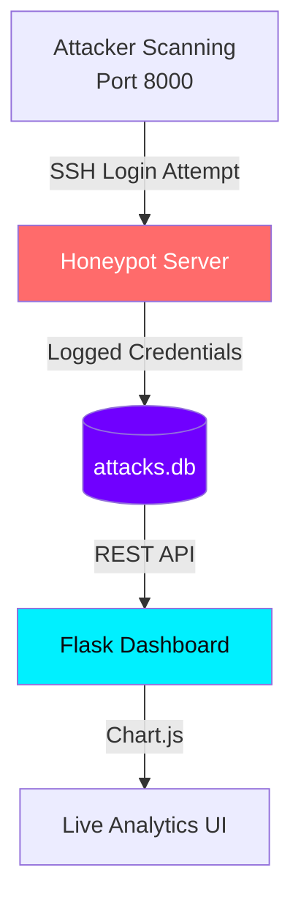
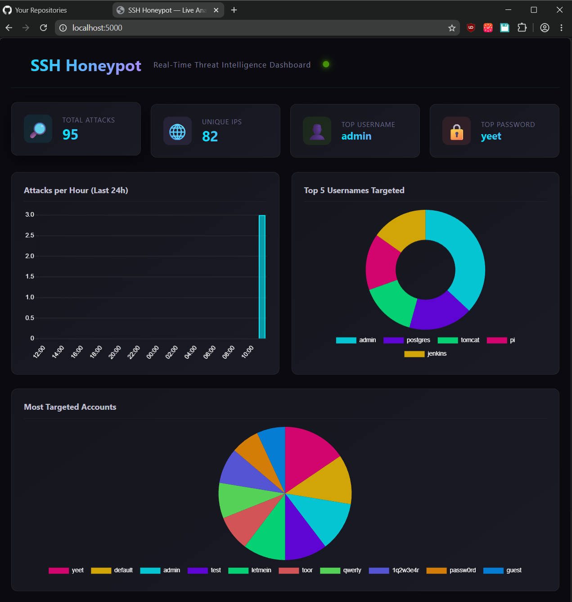
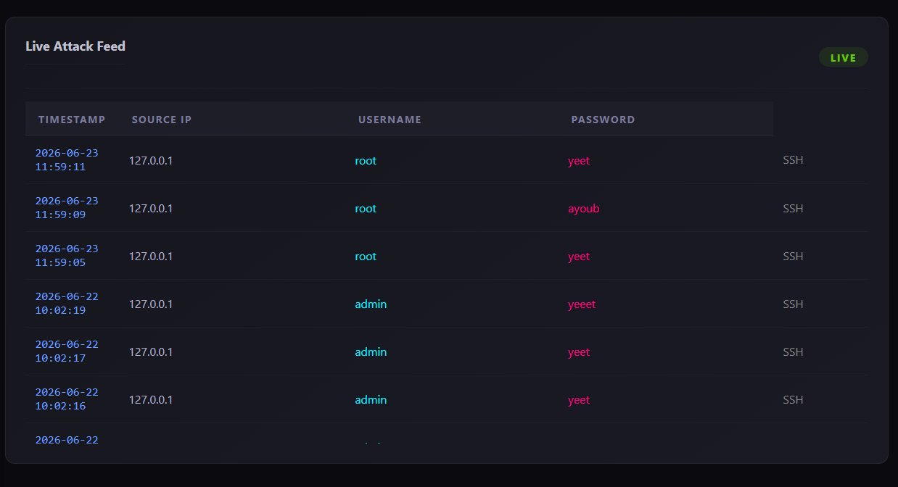
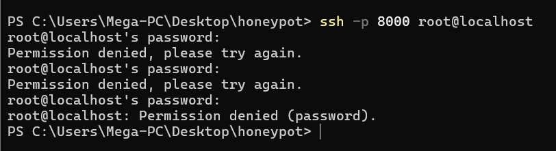

# 🔐 SSH Honeypot — Live Threat Intelligence Dashboard

A minimal, self-contained honeypot that captures real SSH brute-force attempts and visualizes them on a real-time analytics dashboard. Built to simulate a professional SOC analyst's workflow.

---

## What It Does

This project runs a **fake SSH server** (port 8000) that mimics a vulnerable Linux machine. When attackers scan or brute-force the port, the honeypot:

1. **Intercepts** their login attempts (username + password)
2. **Logs** them to a SQLite database with metadata (IP, timestamp, SSH client fingerprint)
3. **Visualizes** everything on a Flask-powered analytics dashboard

The result is a living threat intelligence feed — exactly what you'd see on a SOC dashboard in production.

---

## Architecture



**Data Flow:** Honeypot collects → SQLite persists → Flask serves → Charts render

---

## Screenshots

### Dashboard Overview



### Live Attack Feed



---

## Tech Stack

| Layer | Technology | Why |
|-------|-----------|-----|
| **SSH Emulation** | [Paramiko](https://github.com/paramiko/paramiko) 3.x | Python-native SSH-2 protocol implementation |
| **Web Backend** | Flask 3.x | Lightweight REST API + template serving |
| **Database** | SQLite 3 (Python stdlib) | Zero-config, single-file persistence |
| **Visualization** | Chart.js 4.x | Client-side bar/doughnut/pie charts |
| **UI Styling** | Custom CSS | Dark cyber-themed dashboard |

---

## Quick Start

### Prerequisites

- Python 3.11+

### Installation

```bash
cd honeypot
pip install -r requirements.txt
```

### Running

**Terminal 1 — Start the honeypot (captures attacks):**

```bash
python honeypot.py
# Listening on port 8000
```

**Terminal 2 — Start the dashboard (view analytics):**

```bash
python dashboard.py
# Open http://localhost:5000
```

### Testing the Honeypot

Connect to the honeypot from your terminal or an SSH client:

```bash
ssh -p 8000 root@localhost
# or from another machine:
ssh -p 8000 admin@192.168.1.XXX
```

Any login attempt — **correct or wrong password** — will be captured and logged.



### Optional — Simulate Attack Data

```bash
python generate_mock_data.py
# Generates realistic brute-force campaigns with geographic distribution
```

---

## Dashboard Features

| Metric | What It Shows | SOC Use Case |
|--------|--------------|-------------|
| **Total Attacks** | Cumulative login attempts | Overall threat level |
| **Unique IPs** | Distinct attacker sources | Campaign scope assessment |
| **Top Username** | Most targeted account | Prioritize account hardening |
| **Attacks Per Hour** | Temporal distribution | Identify attack campaigns/timezones |
| **Top Usernames (Pie)** | Attack frequency by account | Understand targeting patterns |
| **Top Passwords (Bar)** | Most tried credentials | Inform password policy enforcement |
| **Live Feed** | Real-time attack log | Incident monitoring |

---

## Project Structure

```
honeypot/
├── honeypot.py          # SSH honeypot server (Paramiko)
├── dashboard.py         # Flask API + web dashboard
├── database.py          # SQLite data layer (6 custom query functions)
├── generate_mock_data.py # Realistic attack simulation
├── attacks.db           # SQLite database (auto-created on startup)
├── requirements.txt     # Python dependencies
├── host_keys/           # RSA + ECDSA SSH host keys
├── templates/
│   └── index.html       # Dashboard UI (Jinja2 template)
└── static/
    ├── script.js        # Chart.js charting + API polling
    └── style.css        # Cyber-themed dashboard styling
```

---

## Security & Design Decisions

- **Input length limiting** (`username[:200]`, `password[:200]`) prevents oversized payloads from corrupting the database
- **Parameterized queries** (`?` placeholders) eliminate SQL injection risk entirely
- **Low-interaction honeypot** — emulates only SSH auth, never executes attacker input
- **SQLite** chosen for zero-config deployment; PostgreSQL would be needed at scale
- **5-second polling** for live feed (production would use WebSockets)

---

## What You'll See in the Data

Real-world SSH honeypots typically capture:

- **Top targeted accounts:** `root`, `admin`, `ubuntu`, `test`
- **Top passwords:** `password`, `123456`, `admin`, `letmein`
- **Tool fingerprinting:** `libssh_0.8.9` (automated scanner) vs `OpenSSH_8.2p1` (human operator)

---

## License

MIT

*Built with paramiko, Flask, Chart.js & SQLite — 2026*
